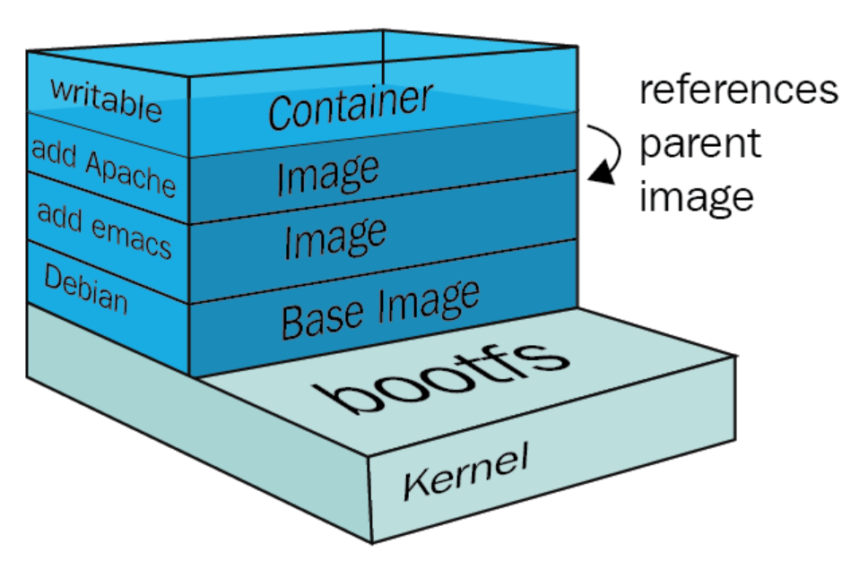
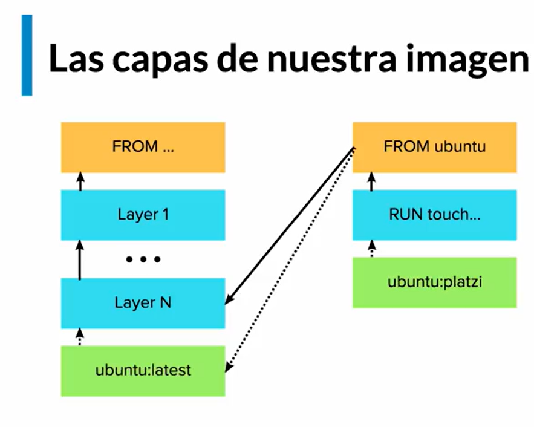
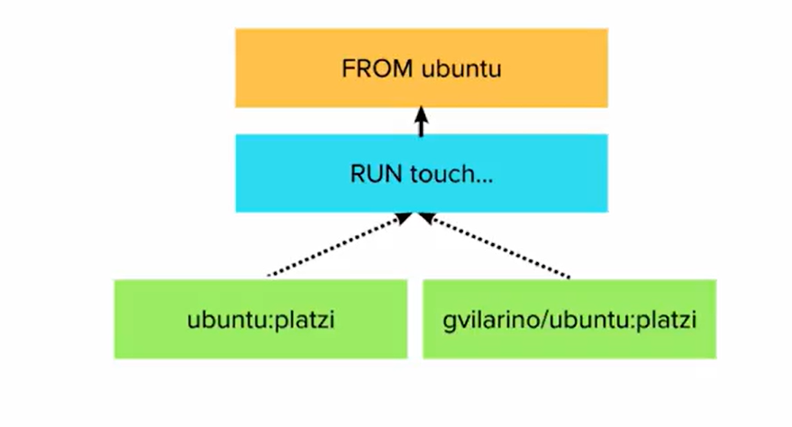

# Docker notes
A simple personal notes for docker

## Contents

## What is docker?
Docker makes development efficient and predictable
Docker takes away repetitive, mundane configuration tasks and is used throughout the development lifecycle for fast, easy and portable application development – desktop and cloud. Docker’s comprehensive end to end platform includes UIs, CLIs, APIs and security that are engineered to work together across the entire application delivery lifecycle.

## See more
- [Docker Page](https://www.docker.com/)
- [Docker Images](https://hub.docker.com/)

## Basic commands with Containers

- Run containers
```
docker run <image_name>
```
- Container Alias
```
docker run --name mycontainer <image_name>
```
- List containers
```
docker ps 
```

- add `-a` to list ALL containers
```
docker ps  -a
```
- Lista el ultimo contenedor terminado (lastest)
```
docker ps -l
```

- Read more about containers
```
docker inspect [container_name]
```

- Rename container
```
docker rename [container_name] [new_container_name]
```
- Remove all inused container
```
docker rm [container_name]
```
- Run linux ubuntu
```
docker run ubuntu
```

- Run linux ubuntu with interactive (it) mode
```
docker run -it ubuntu
```
- Use `exit` to remove linux main process, exit from it (Exit code 0 = OK)

- Copy a local file into container
```
 docker cp ./some_file CONTAINER:/work
```

- Copy files from container to local path

```
 docker cp CONTAINER:/var/logs/ /tmp/app_logs
```
- Copy a file from container to stdout. Please note cp command produces a tar stream
```
 docker cp CONTAINER:/var/logs/app.log - | tar x -O | grep "ERROR"
```

[See more](https://docs.docker.com/engine/reference/commandline/cp/#options)
## Docker life cicle
Cada vez que se ejecuta un contenedor se inicia un proceso llamado main

### Main (Process Id 1)
El contenedor existe siempre y cuando exista el main process

### Sub-Process
Proceso alterno al main process, si falla main process el sub-process seguira existiendo
Example
```
docker run --name [container_name] -d  [image_name] tail -f /dev/null name
```
Run a Ubuntu instance 
```
docker run --name always_up -d  ubuntu tail -f /dev/null name
```
This instance is working on the background and will return the container id


## Images
- A image contains different data layers (differents software, libaries, and personalization)
- Una plantilla se puede comparar con una clase
- Podemos llegar a la conslusión, que una imágen se conforma de distintas capas de personalización, en base a una capa inicial (base image), la dicha capa, es el más puro estado del SO.
- La siguiente ilustración nos mostraría la representación gráfica, del concepto de una imágen en Docker. 

Si observamos, partimos desde la base del SO, y vamos agregando capas de personalización hasta obtener la imágen que necesitamos:

1. distribución debian
2. se agrega el editor emacs
3. se agrega el servidor Apache
4. se agregan los permisos de escritura para la carpeta /var/www de Apache

_Hay que tener en cuenta, que todo parte del Kernel de Linux, en caso de utilizar alguna distrubución de Linux_

### Commands
- List Images installed: 
```
docker image ls
```

- Pull a image: 
```
docker pull [image_name]
```
(You can pull from [Docker Images](https://hub.docker.com/) or your own server)

- History images:
```
docker history [image_id]
```
(check how the image layers)

## Create an image
This process is based on the dockerfile (describe the image)

### Steps: 
1. Create docker file
2. Build the docker file
3. Get the image
4. Run the image
5. Get the container

All commands written on the dockerfile were executed on the execution time.
Agregando una capa de personalización
```
FROM ubuntu:latest

RUN touch /usr/src/hola-course.txt
```

Build the dockerfile
`
docker build -t ubuntu:course .
`

- Internamente estamos creando capas de images que ya existen
 

### Publish docker image
Iniciar sesión
`docker login`

Renombrar una imagen
`docker tag ubuntu:course mrinternauta/ubuntu:test`
Solo se cambia el nombre (no se crea una nueva imagen)

Enviar 
`docker push mrinternauta/ubuntu:test`


## Sistema de imagen
Se puede checar el docker file de cada imagen, cada run ejecuta una capa, en el caso de que no tengamos el dockerfile, puedes ejecutar
`docker history [image_name]`
Otra forma es por medio de [Docker Dive](https://github.com/wagoodman/dive), después de instalar puedes ejecutar
```bash
dive <your-image-tag>
```
Las capas son inmutables y son parte fundamental de las imagenes
(Nos permite que sea muy eficiente para trasmitir imagenes).

- Nota: Un contenedor esta accediendo a la última capa de la imagen y permite realizar cambios en una capa (solo para ese contenedor) mutable del contenedor.

# Docker commit
Docker commit tiene un funcionamiento muy parecido al commit de git.

Guarda el estado de la capa mutable en un tag de la imagen a partir de la cual se genero el contenedor creando una capa mas para crear uno o mas contenedores a partir de esta nueva imagen.

## Usando Docker para desarrollar aplicaciones
Descargar el proyecto
```bash
git clone https://github.com/platzi/docker
```
Note: debe estar en la misma ruta del dockerfile
Construir la imagen localmente 
```bash
docker build -t platziapp . 
```
Listar imagenes
```
docker image ls
```
Ejecutar la imagen en un contenedor que expone el puerto 3000 y cuando se detenga elimina el contenedor (agregar -d para ejecutarlo en el background)
```
docker run --rm  -p 3000:3000 platziapp
```
## Aprovechando el caché de capas para estructurar correctamente tus imágenes
> Layer cache: considera cada uno de los layers cuando intentamos construir una nueva, si queremos construir un layer que ya existe, docker se da cuenta y no la crea sino la asocia, haciendonos ganar tiempo


*Problema*: Cuando estamos en desarrollo constantemente estamos cambiando código y el problema es que debe reconstruir todo de vuelta. Pasa cuando el dockerfile no esta bien estructurado.

Solución: restructurar e dockerfile

Debemos de usar la caché para estructurar el código de forma correcta y así reducir los tiempos y esfuerzos (agilizando los procesos)
Por ejempo solo mantener en tiempo de build los los archivos en el dockerfile en lugar de copiar todo de primera

```
COPY ["package.json", "package-lock.json", "/usr/src/"]
```
De esta forma si lo modificamos los archivos
"package.json", "package.lock.json" nos modificamos en `npm install`

### Evitar hacer build de la imagen en cada cambio de código
Para ello usamos un bind-mount (vamos a compartir los archivos con el contenedor) y vamos a usar nodemon para reiniciar el servidor en cada cambio

1. Cambiar el comando para iniciar el servidor
```
CMD ["npx", "nodemon", "index.js"]
```

2. Hacer build de la imagen (a proposito estoy creando otro tag)
```bash
docker build -t node_app . 
```
3. Correr el contenedor y montar el código
Note: Con $(pwd) se evita escribir todo el path
```
docker run --rm -p 3000:3000 -v $(pwd):/usr/src/ node_app
```
- Solucionar problema de dependencias (Solo copia el index.js) (agregar -d para ejecutarlo en el background)
```
docker run --rm -d -p 3000:3000 -v $(pwd)/index.js:/usr/src/index.js node_app
```
4. Verificar que tu contenedor este corriendo
```bash
docker ps
```
Note: No es practico solo montar el archivo index.js

- Docker file
```
FROM node:14 

COPY ["package.json", "package-lock.json", "/usr/src/"]

WORKDIR /usr/src

RUN npm install

COPY [".", "/usr/src/"]

EXPOSE 3000

CMD ["npx", "nodemon", "index.js"]

```

## Docker networking: colaboración entre contenedores
Crear conexión entre 2 contenedores con docker network
- Listar redes
```
docker network ls
```
- Crear red (con --attachable permites que otros contenedores se conecten a ella)
```
docker network create --attachable mynetwork 
```
- Inspeccionar red
```
docker network inspect mynetwork 
```
### Crear 2 contenedores (Mongo y App)
Note: Eliminar contenedores viejos para evitar problemas `docker rm db -f`

- Contenedor de mongo
```
docker run -d --name db mongo 
```
- Conectar mongo a la red
```
docker network connect mynetwork db
```
Si hacemos un `docker network inspect mynetwork` podemos ver el contenedor conectado

- Ejecutar la aplicacion conectada a esta red
```
docker run -d --name app -p 3000:3000 --env MONGO_URL=mongodb://db:27017/test node_app


```
- Conectar app a la red
```
docker network connect mynetwork app
```

Verificar que esta corriendo la app, debemos ver db y app corriendo
```
docker ps 
```

## Docker Compose: la herramienta todo en uno
> Compose is a tool for defining and running multi-container Docker applications. With Compose, you use a YAML file to configure your application’s services. Then, with a single command, you create and start all the services from your configuration. To learn more about all the features of Compose, see the list of features.

> Compose works in all environments: production, staging, development, testing, as well as CI workflows. You can learn more about each case in Common Use Cases.

[See Docker compose](https://docs.docker.com/compose/)
Permite crear de forma declarativa servicios para nuestro proyecto

### (docker-compose)
- version: debe declararse
- services: nombre del servicio (describe una parte de la aplicación) un servicio puede tener uno o más contenedores de la misma imagen
- depends_on: los contenedores de este servicio dependen de... (primero debe ejecutar el servicio)
- ports: puertos expuestos del servicio (host:container)
- environment: Variables de entorno
- env_file: Archivo con variables de entorno 
```bash
  env_file:
    - .env
```
volumes: Volumen montado en nuestro servicio (host_dir:container_dir)
Ejemplo montando el index.js de nuestro proyecto al container
```bash
    volumes:
      - ./index.js:/usr/src/index.js
```
- container_name: cambiar el nombre al contenedor del servicio
*Note:* Docker compose conecta los contenedores a una misma red
### Comandos

- Ejecutar servicio
Ultilza por defecto el archivo docker-compose.yml
Nota: crea una network por defecto con el nombre de la carpeta (folder_default)
con el commando -d lo ejecuta en background y ejecuta todos los servicios
```
docker-compose up -d
```
- Tambien puedes ejecutar solo un servicio
```
docker-compose up -d <service_name>
```
- Bajar servicio
Baja todos los servicios y redes
```
docker-compose down
```
- Mostrar logs de un servicio
```
docker-compose logs [service_name]
```

- Mostrar logs de un servicio en tiempo real
```
docker-compose logs -f [service_name] [service_name]
```

- Mostrar logs de varios servicios en tiempo real
```
docker-compose logs -f [service_name] [service_name]
```

- Mostrar todos los logs
```
docker-compose logs
```

- Executar bash de container de un servicio

```
docker-compose exec [service_name] bash
```

- Listar los contenedores del proyecto

```
docker-compose ps
```
- Hacer build de un servicio
Debe de existir el contexto `build .`
Hace un skip de db ya que esta esta usando una una imagen 
Tambien de puede solo hacer build de un servicio poniendo el nombre
```
docker-compose build
```
[Network compose](https://docs.docker.com/compose/networking/)
### Docker Compose como herramienta de desarrollo
En el docker-compose copia los archivos del directorio actual `.`
excepto node_modules
```
  volumes:
    - .:/usr/src
    - /usr/src/node_modules
```
- Ejecutar commando en servicio de docker-compose
```
    command: npx nodemon --legacy-watch index.js

```
## Compose en equipo: override
Se puede decir que es una extensión del archivo original docker-compose, lo que permite agregar cambios personales sin alterar docker-compose

> Para disponer de múltiples contenedores (escalar) de un mismo servicio, se requiere habilitar un rango de puertos en el host (máquina donde corre Docker), se realiza mediante la instrucción puerto [PUERTO-PUERTO]. Para escalar un servicio se puede usar el flag “–scale” en el comando up:
```
docker-compose up -d --scale [nameService]=[numberContainers]
```

También se dispone del comando scale:
```
docker-compose scale [service]=[number] [service2]=[number2]
```
[docker compose up](https://docs.docker.com/engine/reference/commandline/compose_up/)

## Tener diferentes override en cada entorno
- docker-compose.override.yml para development
- docker-compose.staging.yml para staging
- docker-compose.production.yml para production

### Ejecutar cada entorno

- para development:
``` docker-compose up ``` 

- para staging:
```
docker-compose \
	-f docker-compose.yml \
	-f docker-compose.staging.yml \
	up -d

``` 

- para production:
```
docker-compose \
	-f docker-compose.yml \
	-f docker-compose.production.yml \
	up
  
``` 

## Administrando tu ambiente de Docker
### Containers
- Ver todos los contenedores
```
docker ps -a
```
- Eliminar todos los contenedores apagados
```
docker container prune
```
- Eliminar TODOS los contenedores
```
docker rm -f $(docker ps -aq)
```
### Network
- Ver todas las redes
```
docker network ls
```
- Eliminar todos las redes apagadas
```
docker network prune
```
### Volumes
- Ver todos los volumenes
```
docker volume ls
```
- Eliminar todos los volumenes  apagadas
```
docker volume prune
```

### Images
- Ver todos las images
```
docker images ls
```
- Eliminar todos las images  apagadas
```
docker images prune
```
- Eliminar TODAS las images
```
docker images rm -f $(docker images ls -aq)
```

### System

- Eliminar contendedores/volumenes/network/images/build apagadas
```
docker system prune
```
## Limitando/Administrando los recursos
Podemos limitar los recursos a los que puede acceder los contenedores de docker

- Limitando memoria
```
docker run -d --name app --memory 1g ubuntu
```
Note:  debemos de cuidar ya que podemos hacer que el contendor no funcione correctamente por memoria limitada (min 4mb)
- Para saber a detalle el estado del contenedor
```
docker inspect server
```
en State.OOMKilled (true = exit for limited memory)
- Saber cuantos recursos esta consumiendo docker
```
docker stats
```
Si no limitamos la memoria de nuestros contenedores cada contenedor va a competir con los demás por recursos

## Deteniendo contenedores correctamente: SHELL vs. EXEC

### En docker podemos construir images apartir de un archivo llamado dockerfile
El archivo nos permite ejecutar un comando que se ejecutara una vez inicie nuestro contenedor

Tenemos 2 formas de ejecutar comandos en la imagen (3 si contamos RUN el cual admite shell y exec)

### Construcción del dockerfile
con shell form y exec form [Ver más](https://programacionymas.com/blog/docker-diferencia-entrypoint-cmd#:~:text=El%20ENTRYPOINT%20especifica%20el%20ejecutable,a%20usar%20con%20dicho%20ejecutable.)
**Shell**: Ejecuta el proceso como hijo del shell
- El problema que quiene sh es que no reenvia las señales del OS a sus procesos hijos y no para con el SIGTERM
```
FROM ubuntu:trusty
COPY ["loop.sh", "/"]
CMD /loop.sh
```
**Exec**: Ejecuta el comando como principal
- Con esto si escucha las señales del OS
```
FROM ubuntu:trusty
COPY ["loop.sh", "/"]
CMD ["/loop.sh"]
```
### Deteniendo contenedor
Docker tiene dos formas de terminar un contenedor
- SIGTERM (Si no responde con SIGTERM despues de 10s manda SIGEXIT)
- SIGEXIT
Para tener una idea clara de como terminan los procesos en linux [Aqui](https://phoenixnap.com/kb/how-to-kill-a-process-in-linux)
- Vamos a comprobar Prueba
- Vamos a images/docker/avanzado/loop
- Crear la imagen con el dockerfile
```
docker build -t loop .
```
- Correr la imagen en un contenedor
```
docker run -d --name looper loop
```
- Parar un contenedor con la señal SIGTERM
```
docker stop looper
```
>Espera a que los procesos que se estan ejecutando termine antes de parar el container (Por lo que puede bloquearse) al menos un tiempo

>The main process inside the container will receive SIGTERM, and after a grace period, SIGKILL.
- Parar un contenedor con la señal SIGEXIT
```
docker kill looper
```

- Lista el último proceso (lastest)
```
docker ps -l
```

- Ver los procesos de un contedor
```
docker exec looper ps -ef
```
NOTE: el comando ps -ef es el comando que se va a ejecutar sobre el contenedor:

ps - lista los procesos (en este caso del contenedor)
-e o -A  - es para listar todos
-f - para mustrarlo en un formato de:
UID : Usuario que lo ejecutó.
PPID : Id del proceso padre.
C : Uso del procesador.
STIME : Inicio de ejecución.
El comando ps es propio de los sistemas unix


Note: Siempre que tengamos un codigo de salida superior a **128** significa que algo malo ocurrio

## Contenedores ejecutables: ENTRYPOINT vs CMD
### ¿Qué ocurre al definir un CMD sin definir un ENTRYPOINT?
Si sólo especificas un CMD, entonces Docker ejecutará dicho comando usando el ENTRYPOINT por defecto, que es /bin/sh -c.

Respecto al "entrypoint" (punto de entrada) y "cmd" (comando), puedes sobreescribir ninguno, ambos, o sólo uno de ellos.

Si especificas ambos, entonces:
- El ENTRYPOINT especifica el ejecutable que usará el contenedor,
- y CMD se corresponde con los parámetros a usar con dicho ejecutable.


**Vamos a images/docker/avanzado/ping**

### Ejemplo sin entrypoint 
Al no contener el entrypoint toma `/bin/ping` y toma como parametros los demás elementos `"-c", "3", "localhost"`, sin embargo el argumento localhost es fijo por lo que no podemos hacer ping a otros destinos
```
  FROM ubuntu:trusty
  CMD ["/bin/ping", "-c", "3", "localhost"]

```
### Ejemplo con entrypoint y cmd
Al usar entry point toma el ejecutable `/bin/ping` como aplicación de entrada y lo que esta en CMD `["localhost"]` de puede cambiar por lo que podemos hacer ping a diferentes destinos
```
  FROM ubuntu:trusty
  ENTRYPOINT ["/bin/ping", "-c", "3"]
  CMD ["localhost"]
 ```

 **Ping a localhost**
 ```
 docker run --name pinger ping
 ```
 **Ping a cualquier otro host**
 ```
 docker run --name pinger ping google.com
 ```

 ### Ver más [aqui](https://programacionymas.com/blog/docker-diferencia-entrypoint-cmd#:~:text=El%20ENTRYPOINT%20especifica%20el%20ejecutable,a%20usar%20con%20dicho%20ejecutable.)

## El contexto de build
Cuando hacemos un build debemos tener en cuenta los archivos que no queremos agregar a la imagen,
para ignorar debemos usar `.dockerignore`

```
*.log
.dockerignore
.git
.gitignore
build
Dockerfile
node_modules
npm-debug.log*
README.md

```
-  Volver a hacer el build de la imagen
`docker build -t <image_name> .`
- Volver a ejecutar el contenedor 
`docker run -d --name <container_name> <image_name>`, Si ya existe un contenedor con ese nombre hay que eliminar la antigua versión primero

Para [Ver más](https://docs.docker.com/engine/reference/builder/#dockerignore-file) acerca de .dockerignore

## Multi-stage build
```
# Define una "stage" o fase llamada builder accesible para la siguiente fase
FROM node:12 as builder
# copiamos solo los archivos necesarios
COPY ["package.json", "package-lock.json", "/usr/src/"]

WORKDIR /usr/src
# Instalamos solo las dependencias para Pro definidas en package.json
RUN npm install --only=production

COPY [".", "/usr/src/"]
# instalamos dependencias de desarrollo
RUN npm install --only=development

# Pasamos los tests
RUN npm run test
## Esta imagen esta creada solo para pasar los tests.

# Productive image
FROM node:12

COPY ["package.json", "package-lock.json", "/usr/src/"]

WORKDIR /usr/src
# instar las dependencias de PRO
RUN npm install --only=production

# Copiar  el fichero de la imagen anterior.
# De cada stage se reutilizan las capas que son iguales.
COPY --from=builder ["/usr/src/index.js", "/usr/src/"]
# Pone accesible el puerto
EXPOSE 3000

CMD ["node", "index.js"]
### En tiempo de build en caso de que algún paso falle, el build se detendrá por completo.
```

- Para crear la imagen 
```
docker build -t node_app_prueba_ignore -f build/production.Dockerfile . 
docker build -t prodapp -f Dockerfile . 
```
(ahora le especifíco el Dockerfile)
- Ejecutar la imagen 
```
docker run -d --rm --name node_test node_app_prueba_ignore
docker run -d --name prod prodapp
```

- [Construcción de imágenes Docker en múltiples etapas](ttps://serrodcal.medium.com/construcci%C3%B3n-de-im%C3%A1genes-docker-en-m%C3%BAltiples-etapas-7933179a3e1f)

- [Advanced Dockerfiles: Faster Builds and Smaller Images Using BuildKit and Multistage Builds](https://www.docker.com/blog/advanced-dockerfiles-faster-builds-and-smaller-images-using-buildkit-and-multistage-builds/)

## Docker-in-Docker
> Existe la Posibilidad de usar Docker desde otros contenedores, se logra usando el Docker socket con bind mount se accede a el archivo docker sock a la maquina anfitriona y accediendo a el desde el otro Docker el cliente puede accederlo puede hablarle directamente.


Docker escucha en un puerto en especifico, el cuál esta en esta dirección
/var/run/docker.sock
- En este ejemplo se crea un contenedor que al mismo tiempo tiene la misma instancia de docker que el host
```
docker run -it --rm -v /var/run/docker.sock:/var/run/docker.sock docker:19.03.12
```

- Ejecutando dive como un contenedor que explora el estado de docker
```
docker run -it --rm -v /var/run/docker.sock:/var/run/docker.sock -v $(which docker):/usr/bin/docker wagoodman/dive node_test
```